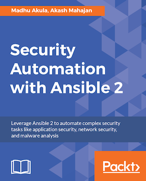

# Madhu Akula

Madhu is a security ninja, security and devops researcher with extensive experience in the industry ranging from client facing assignments building scalable and secure infrastructure, to publishing industry leading research to running training sessions for companies and governments alike.

Madhu's research papers are frequently selected for major security industry conferences including Defcon (26, 24), Blackhat 2018, Appsec EU 2018, All Day DevOps (2016, 2017), DevSecCon (London, Singapore, Boston), DevOpsDays India, c0c0n, Serverless Summit, ToorCon, DefCamp, SkydogCon, NolaCon and null, etc. Madhu was a keynote speaker for the National Cyber Security conference at Dayananda Sagar College in Feb 2016.

When he’s not working with Appsecco’s clients or speaking at events he’s actively involved in researching vulnerabilities in open source products/platforms such as WordPress, Ntop, Opendocman etc. and is also a contributing bug hunter with Code Vigilant (a project to Secure Open Source Software). His research has identified many vulnerabilities in over 200 organisations including US Department of Homeland Security, Google, Microsoft, Yahoo, Adobe, LinkedIn, Ebay, At&t, Blackberry, Cisco, Barracuda etc. He is also an active member with Bugcrowd, Hackerone, Synack etc.

Madhu has trained over 5000 people in information security for companies and organisations including the Indian Navy and the Ministry of e-services in a leading Gulf state. He is co-author of [Security Automation with Ansible2](https://www.secautomationbook.com/) book published by Packt Publishing in December 2017, which is listed as a resource by the RedHat Ansible itself.

## Some of the trainings/workshops by Madhu Akula include

- Attacking & Auditing Docker Containers Using Open Source – Defcon 26
- Building visualisation platforms for OSINT data using open source solutions – Recon Village 2018
- Automated Defense using Cloud Services for AWS, Azure and GCP – Blackhat USA 2018
- Automated Defense using Serverless for AWS, Azure and GCP – Appsec EU 2018
- Breaking and Owning Cloud Servers and Applications - NULLCON Goa 2018
- Ninja Level Infrastructure Monitoring – Defcon 24 and DevSecon London 2016
- Automated Infrastructure Security Monitoring & Defence – DevSecCon Singapore 2017
- Real World Security Monitoring & Automated Defence for almost free – DevSecCon Boston and DevSeCon London 2017
- Monitoring & Defending Infrastructure Security Attacks - c0c0n X
- Linux Container Security – Null Bangalore
- An Introduction to Containers using Docker and using it for Security Automation - Null Bangalore
- Automating Documentation, Presentation, KB using Markdown – Null Bangalore
- Automated infrastructure security monitoring & defence – Null Bangalore

## Some of the talks given by Madhu Akula include

- Modern Security Operations aka Secure DevOps - All Day DevOps 2017
- Automated Defence for Cloud Security in AWS using Serverless - Serverless Summit 2017
- DevOps principles to build your lean startup - Startup Leadership Program
- Developers guide to security & operations: Introducing DevSecOps - Software Security Bangalore Meetup
- Automated Infrastructure Security Monitoring using FOSS – All Day DevOps 2016
- Infrastructure Security Monitoring – DevOps Days India 2016
- Cloud Security for everyone – SDN + IoT + Network Virtualization Enthusiasts Meetup
- NodeJS Security – Null Bangalore
- Web & Cloud Security in the Real World – Keynote speaker at CompTIA Bangalore
- My bug hunting with open source – Hill hacks 2015
- Hardening routers & switches – Null Dharamshala
- Basics of networking - Null Dharamshala

## Published Works of Madhu Akula include

| Cover | Details |
| -- | -- |
| | Book – [Security Automation with Ansible2](https://www.packtpub.com/virtualization-and-cloud/security-automation-ansible-2), Published by PacktPub December 2017, ISBN 9781788394512 |

## Online

| Account | Details |
| -- | -- |
| Twitter | [@madhuakula](https://twitter.com/madhuakula) |
| LinkedIn | [Madhu Akula](https://linkedin.com/in/madhuakula) |
