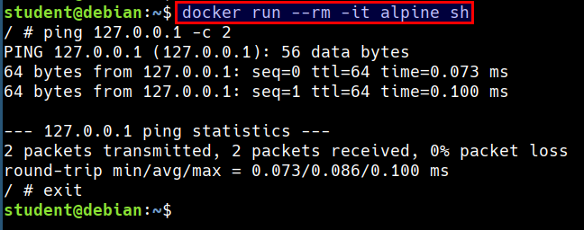
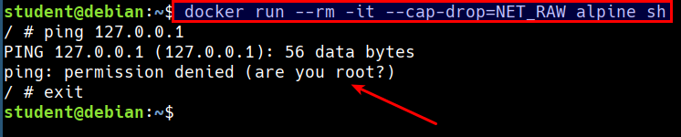
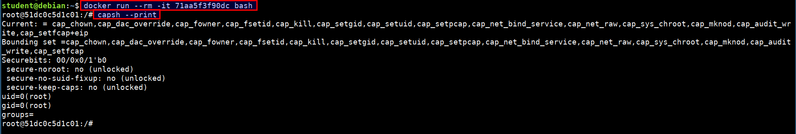
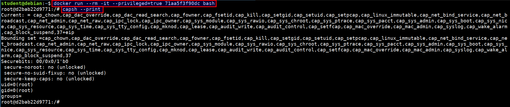
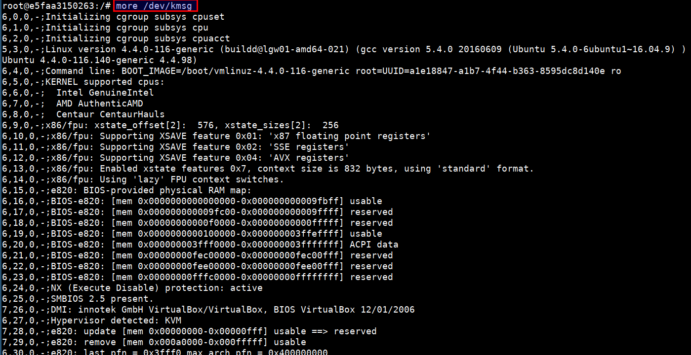

# Capabilities

Capabilities turn the binary "root/non-root" into a fine-grained access control system. Processes (like web servers) that just need to bind on a port below 1024 do not have to run as root, they can just be granted the `net_bind_service` capability instead.

> Starting with kernel 2.2, Linux divides the privileges traditionally associated with superuser into distinct units, known as capabilities, which can be independently enabled and disabled.

## Capabilities Demonstration

* Let's run ping command in a container

```bash
docker run --rm -it alpine sh

ping 127.0.0.1 -c 2
```



* Now, let's remove the `CAP_NET_RAW` capability and try again

```bash
docker run --rm -it --cap-drop=NET_RAW alpine sh

ping 127.0.0.1 -c 2
```




## Checking for the list of capabilities

* We can check the list of capabilities applied the container or system using the below command

```bash
docker run --rm -it 71aa5f3f90dc bash

capsh --print
```




## Running the full privileged container

* Run the below command to start a privileged container

```bash
docker run --rm -it --privileged=true 71aa5f3f90dc bash

capsh --print
```



* It is possible to access the host devices from the privileged containers using `more /dev/kmsg`

> The /dev/kmsg character device node provides userspace access to the kernel's printk buffer.


