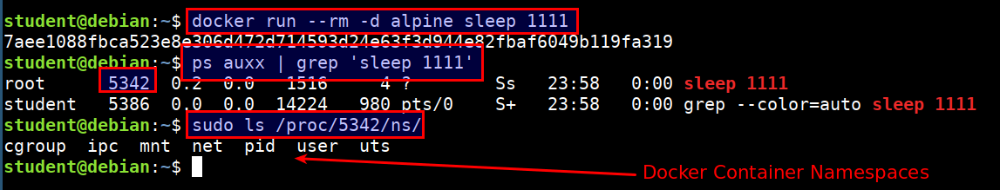
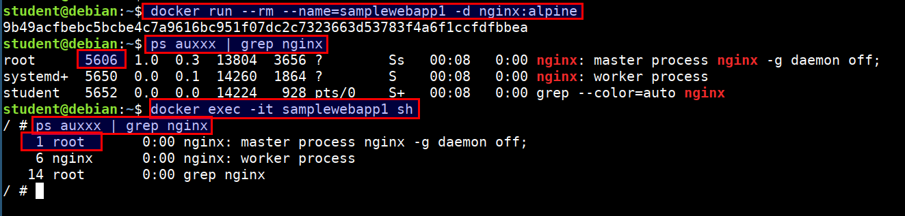
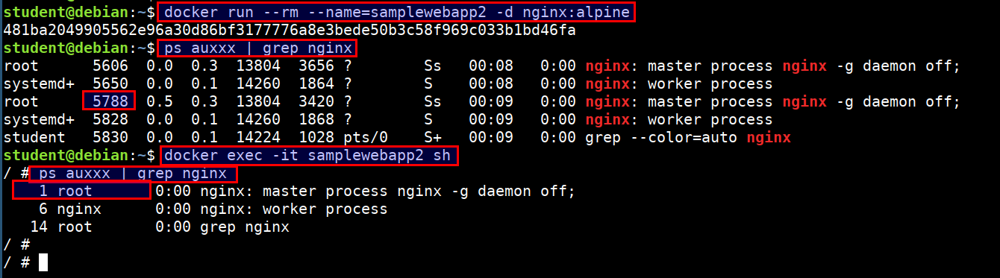
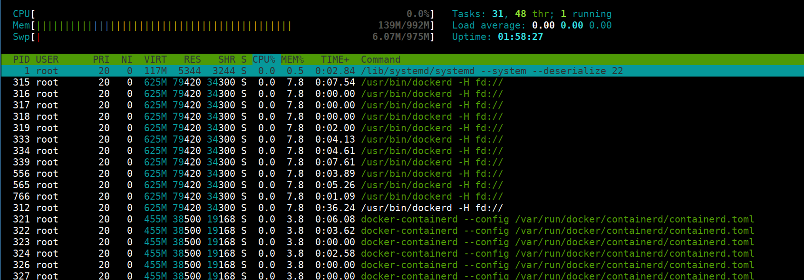

# Namespaces

Docker uses namespaces to provide the isolated workspace called the container. When you run a container, Docker creates a set of namespaces for that container.

* The `pid` namespace: Process isolation (PID: Process ID)
* The `net` namespace: Managing network interfaces (NET: Networking)
* The `ipc` namespace: Managing access to IPC resources (IPC: InterProcess Communication)
* The `mnt` namespace: Managing filesystem mount points (MNT: Mount)
* The `uts` namespace: Different host and domain names (UTS: Unix Timesharing System)
* The `user` namespace: Isolate security-related identifiers (USER: userid, groupid)

## Namespaces Demonstration

```
docker run --rm -d alpine sleep 1111

ps auxx | grep 'sleep 1111'

sudo ls /proc/[pid]/ns/
```



### PID namespace

* PID namespaces isolate the process ID number space, meaning that processes in different PID namespaces can have the same PID

* PID namespaces allow containers to provide functionality such as suspending/resuming the set of processes in the container and migrating the container to a new host while the processes inside the container maintain the same PIDs

> For example, while running nginx docker container we always get PID 1 for nginx but at the host we see a different PID like `9989`

```bash
docker run --rm --name=samplewebapp1 -d nginx:alpine
ps auxxx | grep nginx

docker exec -it samplewebapp1 sh
ps auxxx | grep nginx
```



```bash
docker run --rm --name=samplewebapp2 -d nginx:alpine
ps auxxx | grep nginx

docker exec -it samplewebapp2 sh
ps auxxx | grep nginx
```



* Here we can see that both process have different pids in host system but inside container they both use pid 1

### Attaching host processes to container

* We can also pass or attach the host process namespace or any other container process namespace to container using the --pid flag

```bash
docker run --rm -it --pid=host jess/htop
```


