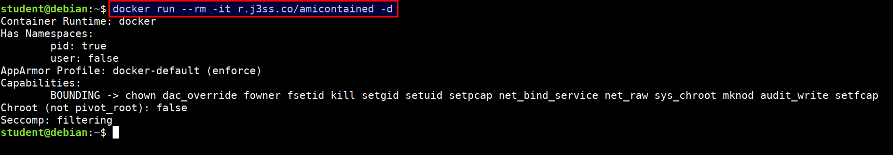
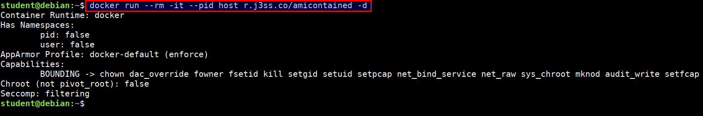
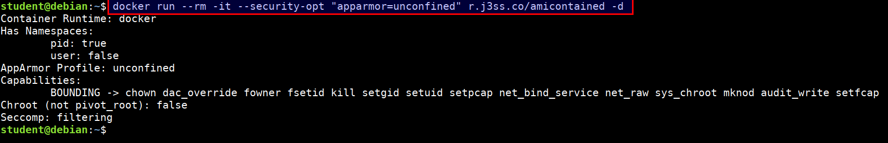

# amicontained

This is a container introspection tool that lets you find out what container runtime is being used as well as the features available.

* Docker container running with no privileges

```bash
docker run --rm -it r.j3ss.co/amicontained -d
```



* Docker container running with host privileges

```bash
docker run --rm -it --pid host r.j3ss.co/amicontained -d
```



* Docker container running with apparmor profile security options

```bash
docker run --rm -it --security-opt "apparmor=unconfined" r.j3ss.co/amicontained -d
```


