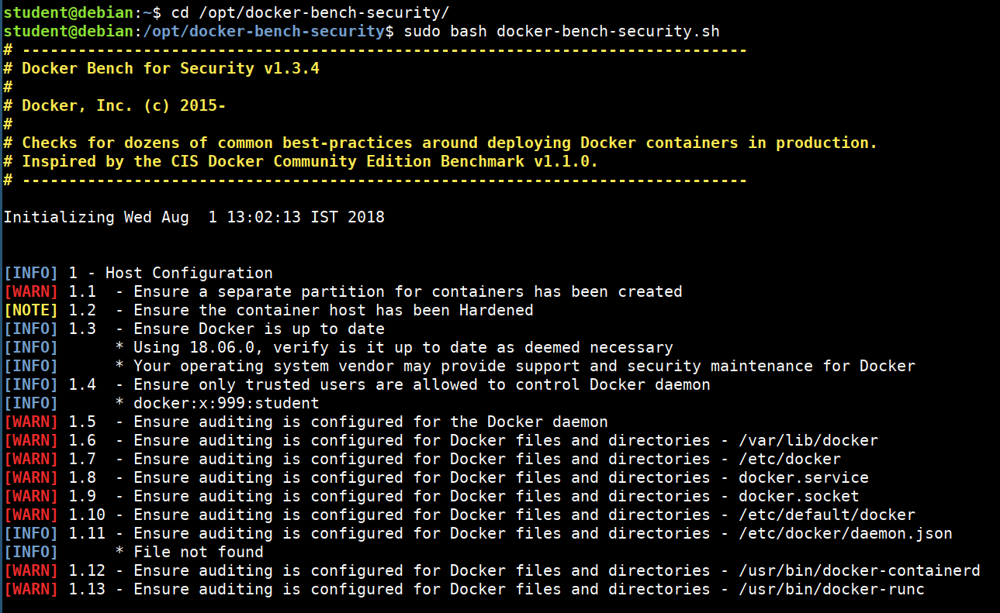

# Docker Bench Security Audit

Docker Bench for Security is a shell script to perform multiple checks against the Docker container environment. It will give a detailed view of the security configuration based on CIS benchmarks. This script supports most of the Unix operating systems as it was built based on the POSIX 2004 compliant.

More details about the tool information can be found at https:/​/github.​com/​docker/docker-​bench-​security

The following are the high-level areas of checks this script will perform

* Host configuration
* Docker daemon configuration and files
* Docker container images
* Docker runtime
* Docker security operations
* Docker swarm configuration

## Running docker bench security

Now lets perform the audit

```bash
cd /opt/docker-bench-security
sudo bash docker-bench-security.sh
```


