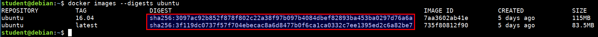
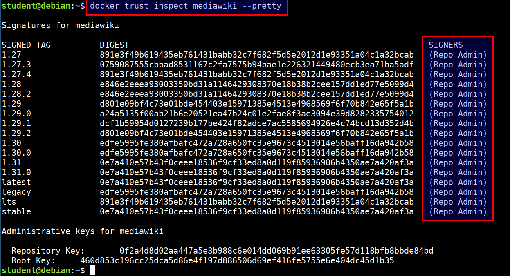
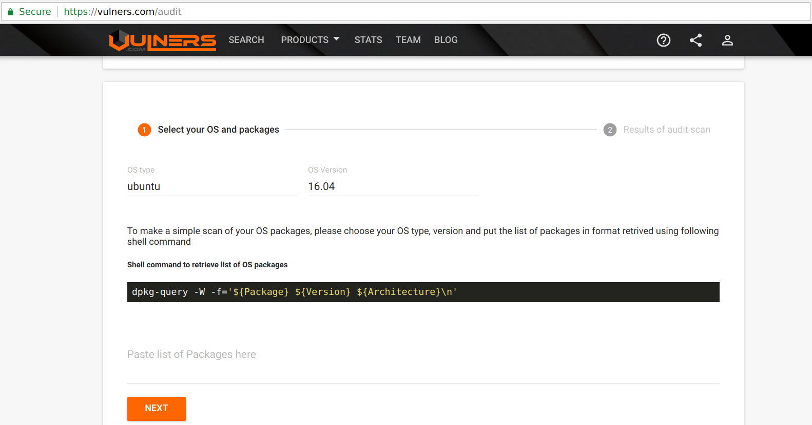
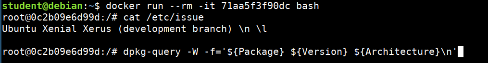
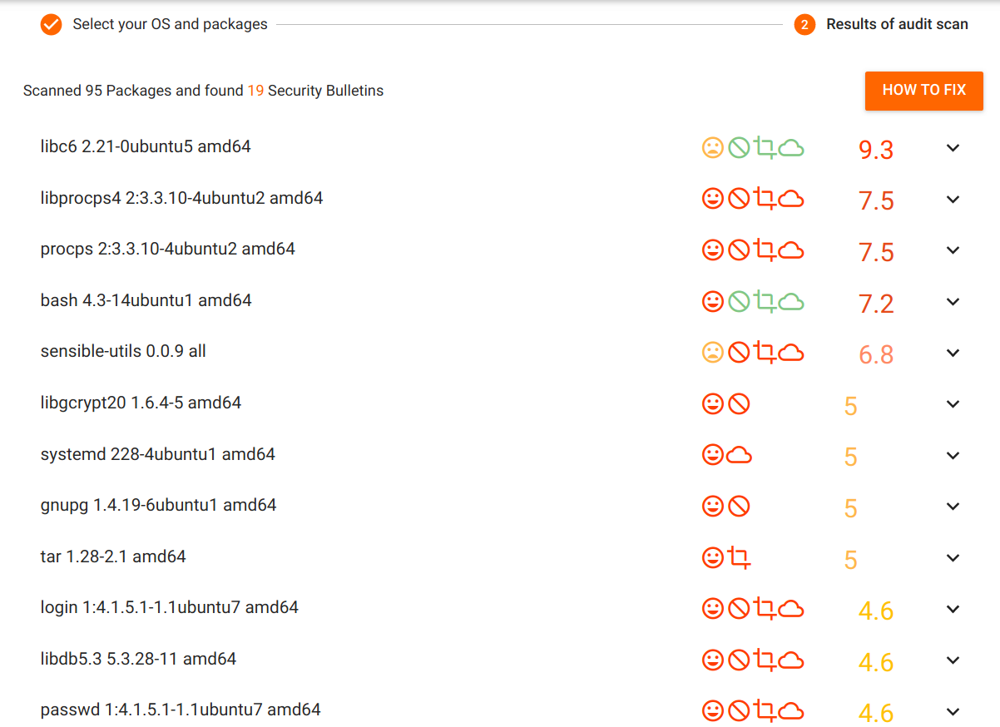
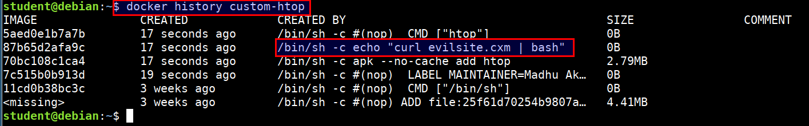

# Auditing Docker Images and Containers

There are multiple checks we can perform to audit against the docker images and containers. Containers are nothing but running instances of an image. We can look at an images's configuration and options to find any issues or misconfigurations.

## Checking the checksum for the images

```bash
docker images --digests ubuntu
```



## Checking for content trust to get signatures

* Content trust is disabled by default. To enable it, set the `DOCKER_CONTENT_TRUST` environment variable to 1

* Checking the image issuers with `docker trust`

```bash
docker trust inspect mediawiki --pretty
```



## Looking for known vulnerabilities

* Most of the containers in dockerhub use base containers. If those aren't updated frequently, then known vulnerabilities might exist in them 

* We can use docker hub registry scanning, clair (Vulnerability Static Analysis for Containers) to check for vulnerable packages in images

* Let's now check for the known vulnerabilities for old docker images using [vulners audit](https://vulners.com/audit)



> Vulners audit tool provides you with the ability to easily check the OS for vulnerable packages. Select your OS type, version and paste the list of installed packages to identify the vulnerable software.

```bash
docker run --rm -it 71aa5f3f90dc bash

cat /etc/issue

dpkg-query -W -f='${Package} ${Version} ${Architecture}\n'
```



* Now, we will paste these packages in the vulners and see the list of known vulnerabilities



## Checking for metadata, secrets and environment variables

* We can check for these data using the `docker inspect` command on both images and containers

```bash
docker inspect <image name>
docker inspect <container name>
```

## Looking the docker image history

* Run the below command to show the history of a docker image. This will list the commands that were used for creating the image

```bash
docker history custom-htop
```


