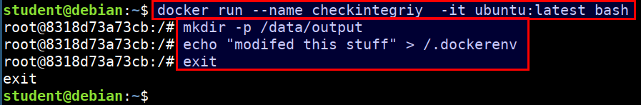
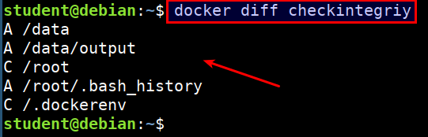

# Docker integrity check for containers

* We can list the changed files and directories in a containers file system
* There are 3 events that are listed in the diff
    * A - Add
    * D - Delete
    * C - Change

## Demonstration

* Let's run a ubuntu container and perform some changes

```bash
docker run --name checkintegriy  -it ubuntu:latest bash
mkdir -p /data/output
echo "modifed this stuff" > /.dockerenv
exit
```



* Now lets see the diff using the following command

```bash
docker diff checkintegriy
```


