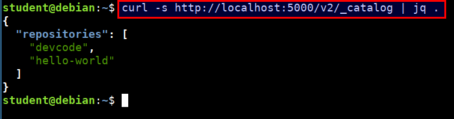
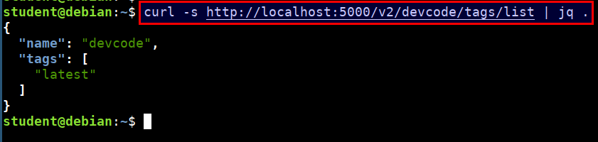
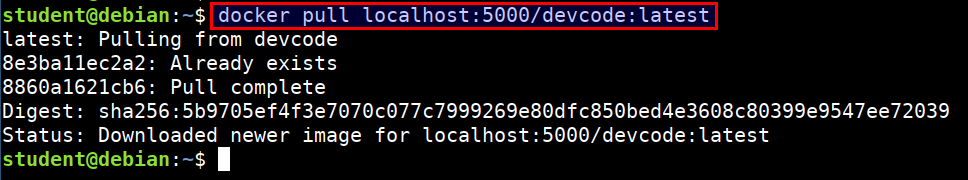
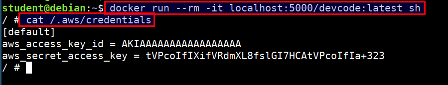
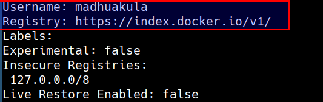
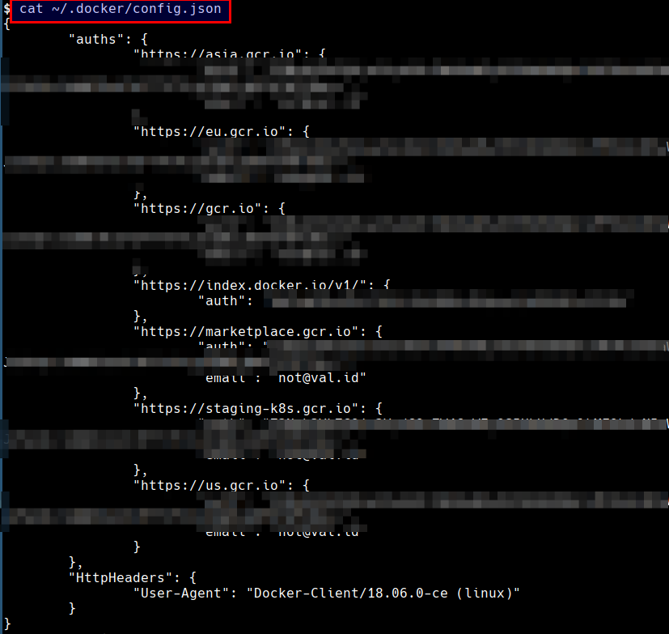

# Auditing Docker Registries

A Docker registry is a distribution system for Docker images. There will be different images and each may contain multiple tags and versions. By default the registry runs on port `5000` without authentication and TLS.

In this section, we will be using a simple unauthenticated docker private registry to perform security audit.

* We can check if the docker registry is up by running the following command in the student VM

```bash
curl -s http://localhost:5000/v2/_catalog | jq .
```



* Get the list of tags and versions of a docker image from the registry

```bash
curl -s http://localhost:5000/v2/devcode/tags/list | jq .
```



* Downloading a registry image locally

```bash
docker pull localhost:5000/devcode:latest
```



* Reviewing the container for sensitive data and hard coded secrets

```bash
docker run --rm -it localhost:5000/devcode:latest sh

cat /.aws/credentials
```



* Lets check the default docker daemon configuration. This prints the default username and registry used by the docker run time

```bash
docker system info
```



* Lets look for the configured registries from the host. The credentials may authorize us to pull and/or push images to the registry

```bash
cat ~/.docker/config.json
```


