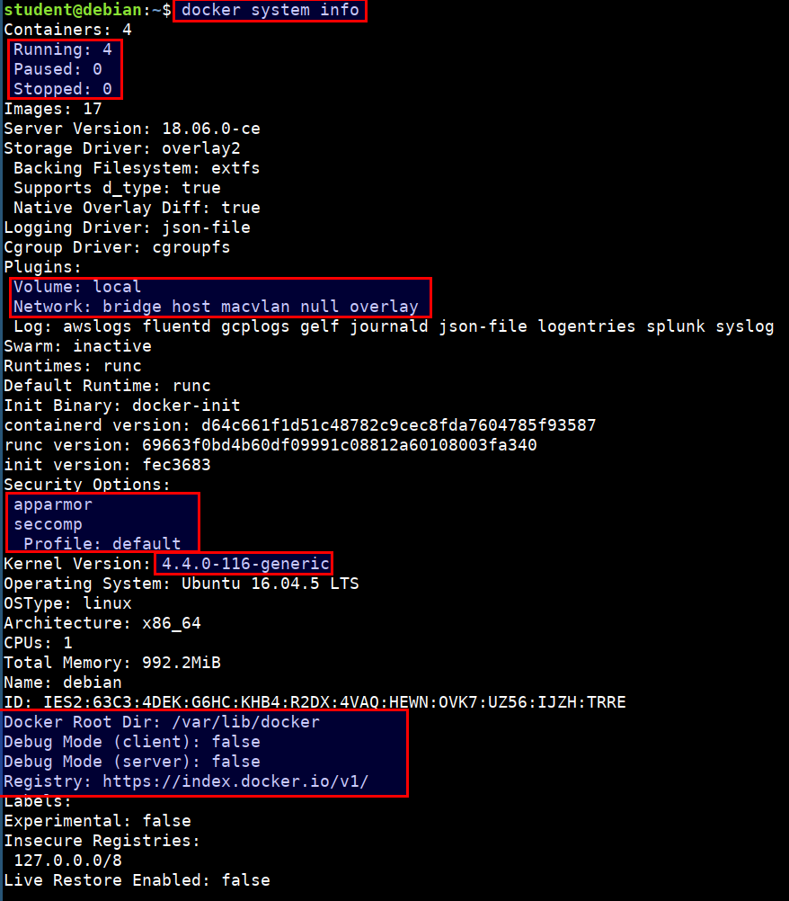
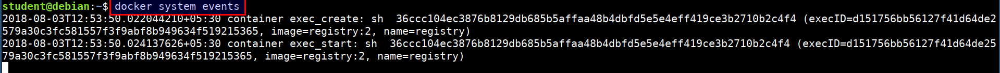
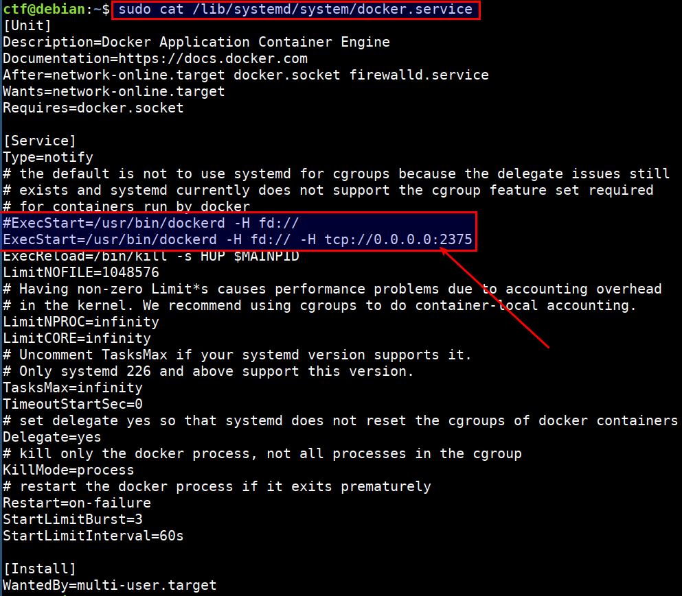
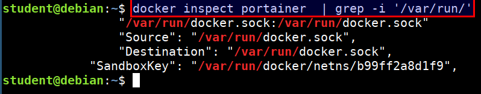
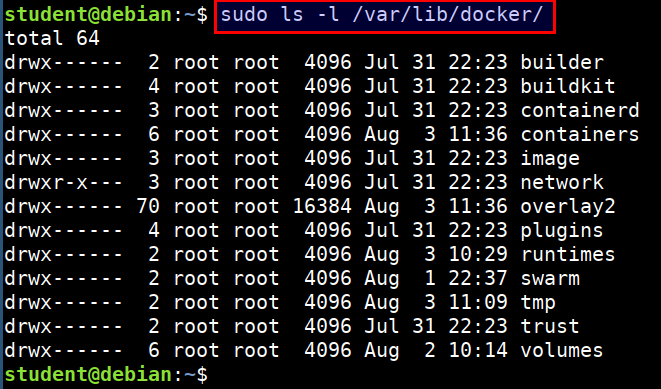

# Auditing Docker Runtime and Endpoints

* Checking for the docker daemon configuration

```bash
docker system info
```



* Looking for the global events generated by the docker runtime

```bash
docker system events
```



* Checking for the docker API exposed on `0.0.0.0`

```bash
sudo cat /lib/systemd/system/docker.service
```



* Checking if the docker socket is mounted to any running container

```bash
docker inspect | grep -i '/var/run/'
```



* Checking other files and data related to docker

```bash
sudo ls -l /var/lib/docker/
```


