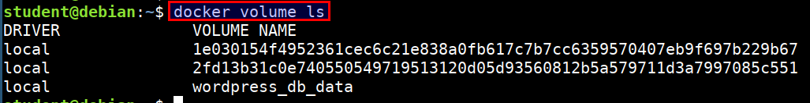
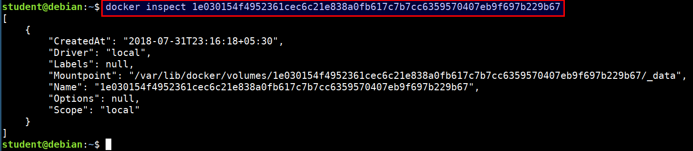
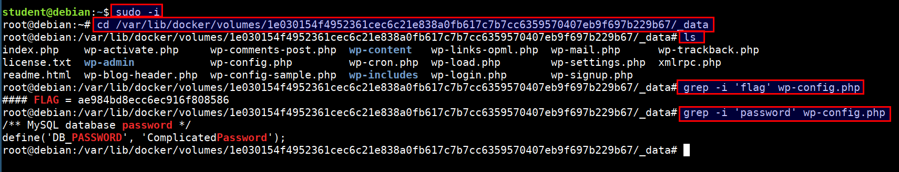
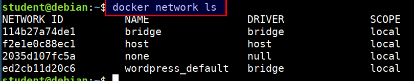
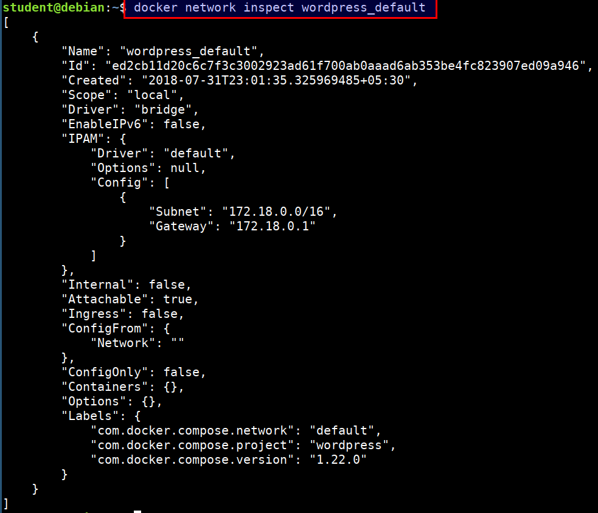

# Auditing Docker Volumes and Networks

## Listing and inspecting the docker volumes

* Listing docker volumes

```bash
docker volume ls
```



* Inspecting docker volumes

```bash
docker volume inspect 1e030154f4952361cec6c21e838a0fb617c7b7cc6359570407eb9f697b229b67
```



* Looking for sensitive data and secrets

```bash
sudo -i
cd /var/lib/docker/volumes/1e030154f4952361cec6c21e838a0fb617c7b7cc6359570407eb9f697b229b67/_data
ls
grep -i 'flag' wp-config.php
grep -i 'password' wp-config.php
```



* Volumes can be used with Ready-Only, Read-Write modes

## Listing and inspecting the docker networks

* Docker by default creates it's own networking namespace when we use Docker Swarm or Docker Compose

* By default bridge, host, null networking options are available

* Listing the docker networks

```bash
docker network ls
```



* Inspecting the docker network

```bash
docker inspect wordpress_default
```



> We can use our traditional tool set like `nmap` (or) `nc` for performing scans and information gathering
