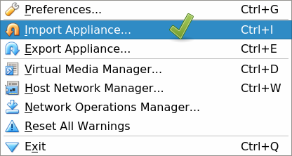
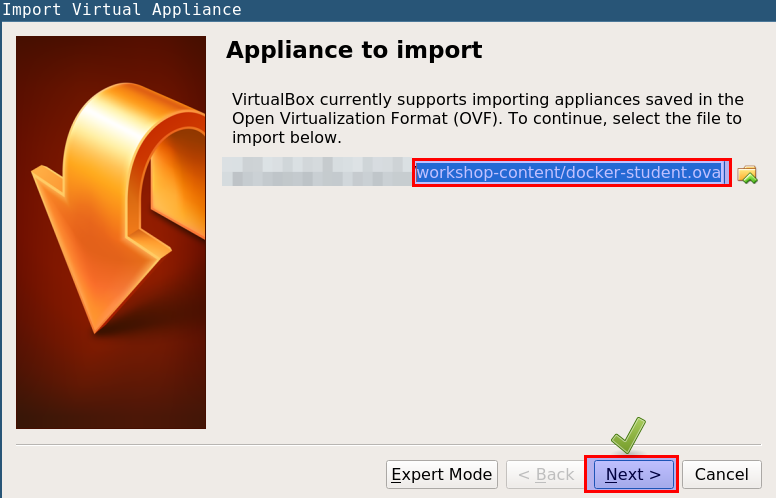
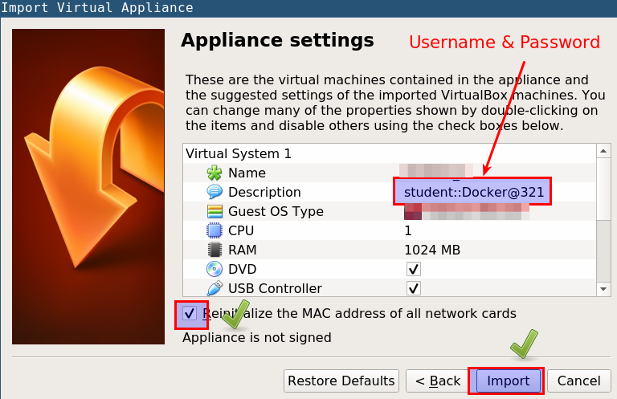
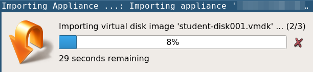
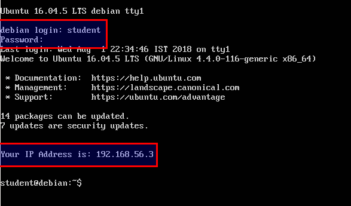
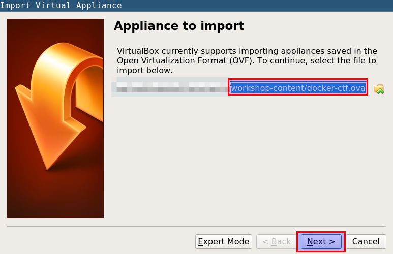
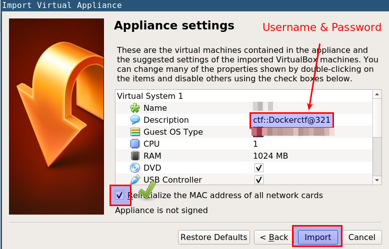
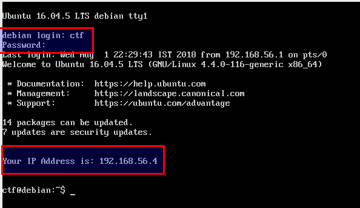

# Importing virtual machines

* Download the virtual machines from [https://sourceforge.net/projects/defcon-26-container-security/](https://sourceforge.net/projects/defcon-26-container-security/)

## student machine (docker-student.ova)

* Open VirtualBox, and select `File` -> `Import Appliance` from the top menu



* Select `docker-student.ova` file from the `workshop-content` folder



* Check the "Reinitialize the MAC address of all network cards" checkbox, and click on Next to import the ova file



* Now we can see that ova file is importing



* Use following credentials for `student` VM login

```bash
username: student
password: Docker@321
```



* Your IP address may differ from what is visible in the screenshot. Please note down this IP address for later use

## ctf machine (docker-ctf.ova)


* Open VirtualBox, and select `File` -> `Import Appliance` from the top menu


* Select `docker-ctf.ova` file from the `workshop-content` folder



* Check the "Reinitialize the MAC address of all network cards" checkbox, and click on Next to import the ova file



* Use following credentials for `ctf` VM login

```bash
username: ctf
password: Dockerctf@321
```



* Your IP address may differ from what is visible in the screenshot. Please note down this IP address for later use
