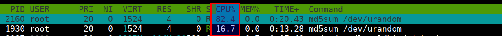

# Control Groups - [DEMO]

The kernel uses cgroups also known as control groups to group processes for the purpose of system resource management. cgroups allocate CPU time, system memory, network bandwidth, or combinations of these among user-defined groups of tasks.

* Let's run two containers with different cpu shares

```bash
docker run -d --name='low_priority' \
    --cpuset-cpus=0 --cpu-shares=10 alpine md5sum /dev/urandom

docker run -d --name='high_priority' \
    --cpuset-cpus=0 --cpu-shares=50 alpine md5sum /dev/urandom
```

* Now we can see the utilization status by running `htop`

```bash
docker run --rm -it --pid host jess/htop
```



* Stop and remove the running containers

```bash
docker stop low_priority high_priority
docker rm low_priority high_priority
```

* Now run the containers without any cpu shares specified

```bash
docker run -d --name='low_priority' alpine md5sum /dev/urandom
docker run -d --name='high_priority' alpine md5sum /dev/urandom
```

* Check resource utilization using `htop`

```bash
docker run --rm -it --pid host jess/htop
```


* Stop and remove the running containers

```bash
docker stop low_priority high_priority
docker rm low_priority high_priority
```
