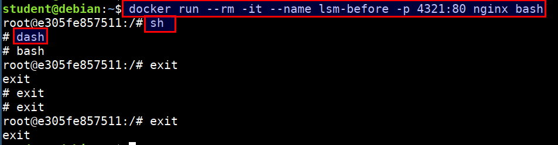
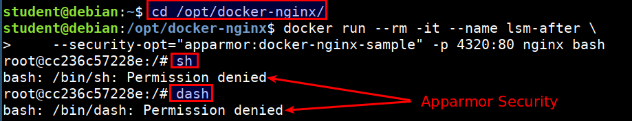

# LSM

The Linux Security Module (LSM) framework provides a mechanism for various security checks to be hooked by new kernel extensions.

The primary users of the LSM interface are Mandatory Access Control (MAC) extensions which provide a comprehensive security policy. Examples include SELinux, Smack, Tomoyo, and AppArmor.

## LSM Demonstration

* Let's run a simple nginx container

```bash
docker run --rm -it --name lsm-before -p 4321:80 nginx bash

sh
dash
bash
```



* Now lets apply the apparmor profile for the container and see if we can perform other operations like `sh` and `dash`

```bash
cd /opt/docker-nginx

sudo bane sample.toml

docker run --rm -it --name lsm-after \
    --security-opt="apparmor:docker-nginx-sample" -p 4320:80 nginx bash

sh
dash
bash
```



* Have a look at `cat /opt/docker-nginx/docker-nignx-sample` file for the apparmor profile that was created using [bane](https://github.com/genuinetools/bane)
