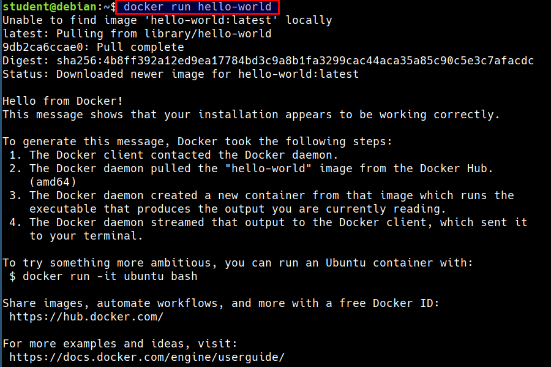
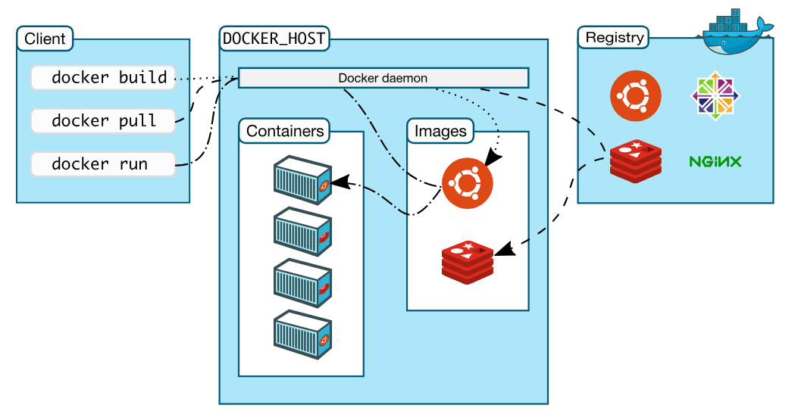
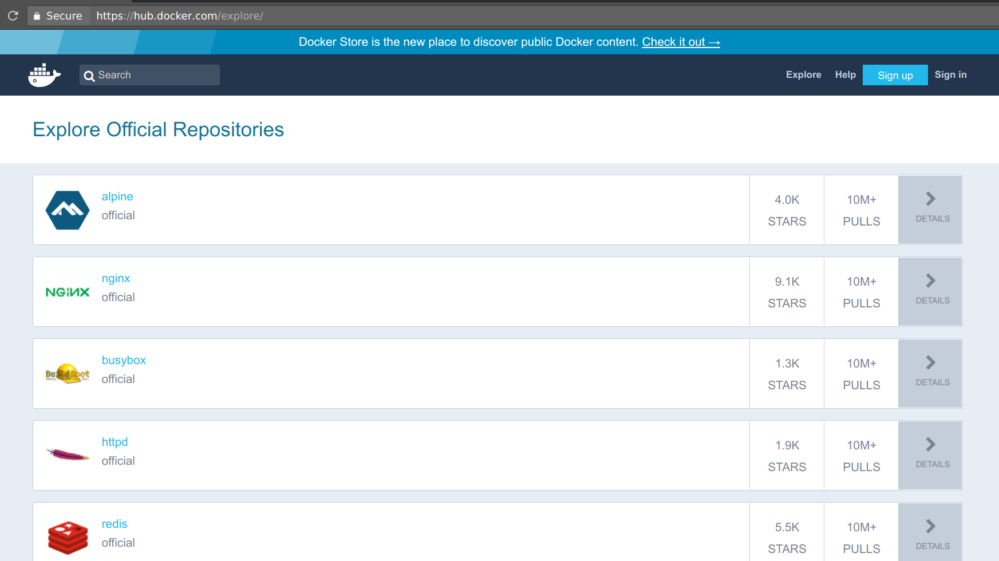
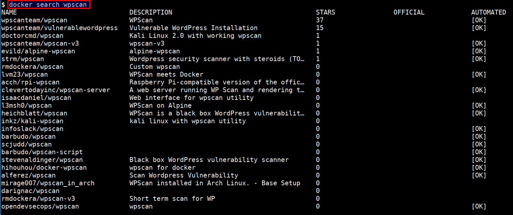

# Getting started with docker

## Introduction

Docker containers wrap a piece of software in a complete file system that contains everything needed to run: code, runtime, system tools, system libraries and anything that can be installed on a server. This guarantees that the software will always run the same, regardless of its environment.


### Run your first docker container

```bash
docker run hello-world
```

* When you run `docker run` command
    * Docker engine checks if the image is available or not
    * If image is not available, docker engine will pull from docker registry
    * If image is available, docker engine will run the command locally




### How Docker Works?

* `Docker` is the program that enables containers to be built, shipped and run
* Docker Engine uses Linux Kernel namespaces and control groups



<small>Image Reference: https://docs.docker.com/engine/docker-overview/</small>

### Terminology

* Docker Image
    * Read only file with OS, libraries and apps
    * Anyone can create a docker image
    * Images can be stored in Docker hub (default public registry) or private registry
* Docker Container
    * Stateful instance of an image with a writable layer
    * Contains everything needed to run your application
    * Based on one or more images
*  Docker Registry
    * Repository of images
* Docker Hub
    * Public docker registry

### What is Docker Hub?

* Docker Hub is the public registry that contains a large number of images available for your use




### Docker Search

* You can also search through all publicly available images in docker hub

```bash
docker search wpscan
```

