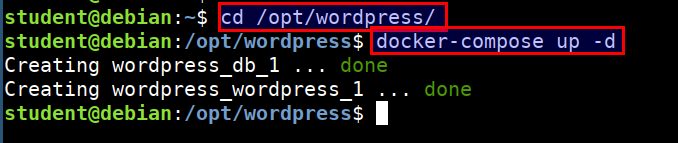
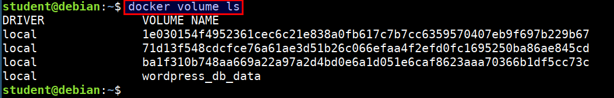
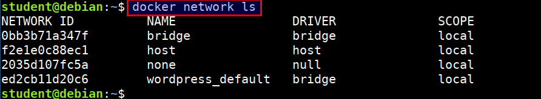

# Docker volumes and networks

## Setting up wordpress site using docker-compose

Compose is a tool for defining and running multi-container Docker applications. With Compose, you use a Compose file to configure your application's services. Then, using a single command, you create and start all the services from your configuration


* Let's setup wordpress site using docker-compose

```bash
cd /opt/wordpress
docker-compose up -d
```



* Access the wordpress site using `http://STUDENTVMIP:8000`


## Checking for the docker volumes

* Listing the docker volumes

```bash
docker volume ls
```



* Listing the docker networks

```bash
docker network ls
```

