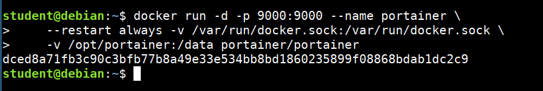
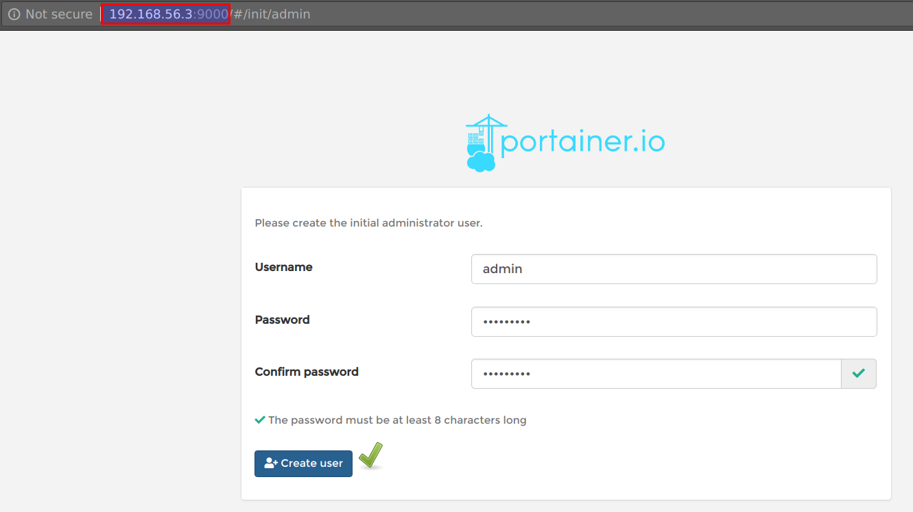
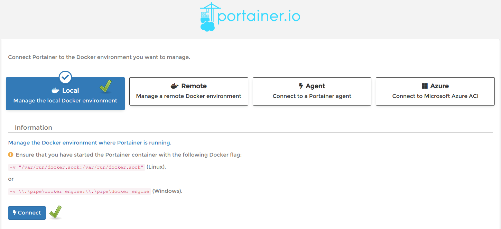
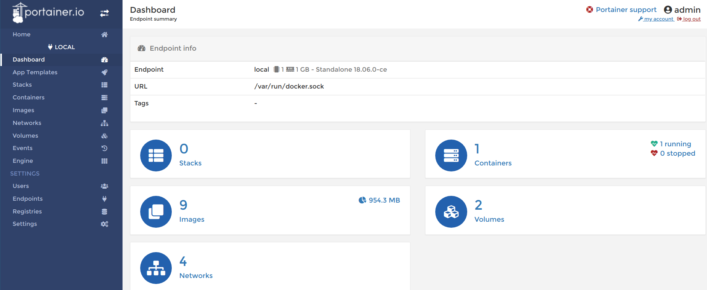

# Portainer

Portainer is a simple management solution for Docker. Easily manage your Docker hosts and Docker Swarm clusters via Portainer web user interface.

* Run portainer using the below command

```bash
docker run -d -p 9000:9000 --name portainer \
    --restart always -v /var/run/docker.sock:/var/run/docker.sock \
    -v /opt/portainer:/data portainer/portainer
```



* Now you can access portianer at http://STUDENTVMIP:9000





